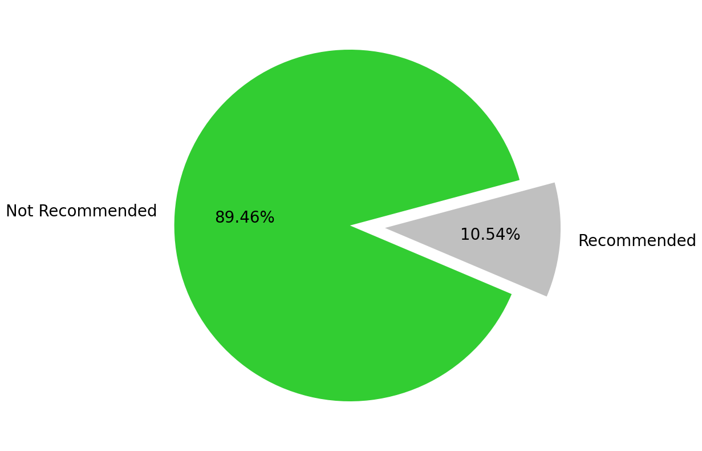

# PORTFOLIO
---
## EMPLOYEE PROMOTION RECOMMENDATION PREDICTION

Employee promotion recommendation prediction using random forest classification with SMOTE-NC.

This project aims to identify which candidates are worth to be recommended for promotion based on several attributes in the form of past and current performances and demographics. 

